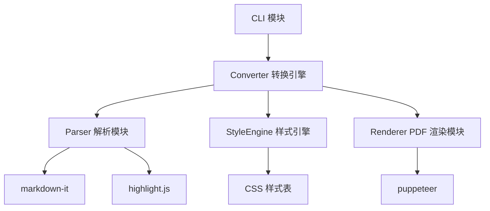

# 设计文档：Markdown 转 PDF

## 概述

本功能实现一个命令行工具，将 Markdown 格式的 API 文档转换为排版美观的 PDF 文件。采用 **Markdown → HTML → PDF** 的技术路线：

1. 使用 `markdown-it` 将 Markdown 解析为 HTML
2. 通过 CSS 控制排版样式（标题层级、代码高亮、表格、中文排版等）
3. 使用 `puppeteer` 将带样式的 HTML 渲染为 PDF

这种方案利用浏览器引擎的排版能力，天然支持复杂的 CSS 样式、中文排版、代码高亮等需求，输出质量远优于直接操作 PDF 原语的方案。

### 技术选型理由

| 方案 | 优点 | 缺点 |
|------|------|------|
| markdown-it + puppeteer（选用） | 样式灵活、排版质量高、中文支持好、CSS 生态丰富 | 依赖 Chromium，包体积较大 |
| markdown AST + pdfkit | 包体积小、无外部依赖 | 排版能力弱、样式控制困难、中文支持需额外处理 |

## 架构

### 整体流程


### 模块划分



- **CLI 模块**：解析命令行参数，协调转换流程
- **Parser 模块**：使用 markdown-it 将 Markdown 解析为 HTML，集成 highlight.js 实现代码高亮
- **StyleEngine 模块**：管理 CSS 样式，组装完整的 HTML 页面（含封面页、页眉页脚等）
- **Renderer 模块**：使用 puppeteer 将 HTML 渲染为 PDF

## 组件与接口

### 依赖库

- `markdown-it`：Markdown 解析器，支持 CommonMark 规范及扩展
- `markdown-it-table`（或内置表格支持）：表格解析
- `highlight.js`：代码语法高亮
- `puppeteer`：无头 Chrome，HTML 转 PDF
- `commander`：命令行参数解析

### Parser 模块

```typescript
interface ParserOptions {
  highlightTheme?: string; // highlight.js 主题，默认 'github'
}

interface ParseResult {
  html: string;          // 解析后的 HTML 片段
  title: string | null;  // 从第一个 H1 提取的文档标题
  headings: Heading[];   // 标题列表，用于生成书签
}

interface Heading {
  level: number;   // 1-6
  text: string;    // 标题文本
  id: string;      // 锚点 ID
}

function parse(markdown: string, options?: ParserOptions): ParseResult;
```

**实现要点**：
- 使用 `markdown-it` 并启用表格插件
- 配置 `highlight.js` 作为代码高亮回调
- 解析过程中收集标题信息用于生成 PDF 书签
- 为 HTTP 方法标记（GET/POST/PUT/DELETE/PATCH）添加特殊 CSS class

### StyleEngine 模块

```typescript
interface StyleOptions {
  title?: string;        // 文档标题（封面页用）
  date?: string;         // 生成日期（封面页用）
  pageNumbers?: boolean; // 是否显示页码，默认 true
}

function buildFullHTML(bodyHtml: string, headings: Heading[], options?: StyleOptions): string;
function getDefaultCSS(): string;
```

**实现要点**：
- 内置默认 CSS 样式表，覆盖：
  - 标题层级样式（H1-H6 递减字号）
  - 代码块样式（等宽字体 + 背景色 + 语法高亮）
  - 表格样式（边框 + 表头背景色）
  - 有序/无序列表样式
  - HTTP 方法颜色标签（GET=绿色, POST=蓝色, PUT=橙色, DELETE=红色, PATCH=紫色）
  - API 端点 URL 等宽字体样式
  - 中文排版（字体族、行高、标点挤压）
- 封面页 HTML 生成
- H1 前分页符（`page-break-before: always`）
- 页码通过 CSS `@page` 规则 + puppeteer 的 `headerTemplate`/`footerTemplate` 实现

### Renderer 模块

```typescript
interface RenderOptions {
  outputPath: string;
  format?: 'A4' | 'Letter';  // 默认 A4
  margin?: {
    top?: string;
    bottom?: string;
    left?: string;
    right?: string;
  };
}

async function renderPDF(html: string, headings: Heading[], options: RenderOptions): Promise<void>;
```

**实现要点**：
- 启动 puppeteer 无头浏览器
- 设置页面内容为完整 HTML
- 使用 `page.pdf()` 生成 PDF，配置：
  - 页面尺寸和边距
  - `displayHeaderFooter: true` 用于页码
  - `printBackground: true` 用于代码块背景色
- 利用 puppeteer 的 PDF outline 支持或通过 `<h1>`-`<h6>` 标签自动生成书签
- 生成完毕后关闭浏览器实例

### CLI 模块

```typescript
interface CLIArgs {
  input: string;       // 输入 Markdown 文件路径
  output?: string;     // 输出 PDF 文件路径（可选）
}

function parseArgs(argv: string[]): CLIArgs;
async function run(args: CLIArgs): Promise<void>;
```

**实现要点**：
- 使用 `commander` 解析命令行参数
- 输入文件路径为必需参数
- 输出路径默认为输入文件同目录下同名 `.pdf` 文件
- 转换成功后输出 PDF 文件路径
- 参数缺失时显示使用说明并以非零退出码退出

## 数据模型

### 转换流水线数据流

```
输入: string (Markdown 文件路径)
  ↓ fs.readFile
中间: string (Markdown 文本)
  ↓ markdown-it.render + highlight.js
中间: ParseResult { html, title, headings }
  ↓ StyleEngine.buildFullHTML
中间: string (完整 HTML 页面，含 CSS)
  ↓ puppeteer.page.pdf
输出: Buffer → 写入 PDF 文件
```

### Heading 数据结构

```typescript
interface Heading {
  level: number;   // 标题层级 1-6
  text: string;    // 标题纯文本内容
  id: string;      // 生成的锚点 ID（用于书签）
}
```

### CSS 样式结构

样式按功能分层组织：

1. **基础排版**：字体族、字号、行高、页面边距
2. **标题样式**：H1-H6 字号递减、间距
3. **代码样式**：等宽字体、背景色、highlight.js 主题色
4. **表格样式**：边框、表头背景、单元格内边距
5. **列表样式**：有序/无序列表缩进和标记
6. **API 特定样式**：HTTP 方法颜色标签、URL 等宽字体
7. **中文排版**：中文字体族、中英文混排间距、标点处理
8. **打印控制**：分页符、页码、封面页布局


## 正确性属性

*属性是一种在系统所有有效执行中都应成立的特征或行为——本质上是对系统应做什么的形式化陈述。属性是人类可读规格说明与机器可验证正确性保证之间的桥梁。*

### 属性 1：Markdown 元素解析完整性

*对于任意* 包含标题（H1-H6）、段落、代码块、表格、列表、链接或图片元素的 Markdown 文本，调用 `parse()` 后返回的 HTML 应包含对应的 HTML 标签（`<h1>`-`<h6>`, `<p>`, `<pre><code>`, `<table>`, `<ul>`/`<ol>`, `<a>`, ``）。

**验证需求: 1.1, 1.2, 2.5**

### 属性 2：解析幂等性

*对于任意* 有效的 Markdown 文本，调用 `parse()` 两次应产生完全相同的 HTML 输出。即 `parse(md) === parse(md)` 恒成立。

**验证需求: 1.5, 1.6**

### 属性 3：PDF 输出有效性

*对于任意* 非空的 Markdown 文本，经过完整的转换流水线（parse → buildFullHTML → renderPDF）后，生成的文件应为有效的 PDF（文件内容以 `%PDF-` 开头）。

**验证需求: 2.1**

### 属性 4：标题字号递减

*对于任意* CSS 样式表中 H1 到 H6 的 font-size 定义，`fontSize(H_n) > fontSize(H_{n+1})` 对所有 `n ∈ [1,5]` 成立。

**验证需求: 2.2**

### 属性 5：CLI 参数解析正确性

*对于任意* 有效的输入文件路径和可选的输出文件路径，`parseArgs()` 应正确提取输入路径，且当提供输出路径时应正确提取输出路径。

**验证需求: 3.1, 3.2**

### 属性 6：默认输出路径推导

*对于任意* 输入文件路径（如 `/path/to/doc.md`），当未指定输出路径时，默认输出路径应为同目录下同名文件加 `.pdf` 扩展名（即 `/path/to/doc.pdf`）。

**验证需求: 3.3**

### 属性 7：HTTP 方法颜色标记

*对于任意* 包含 HTTP 方法关键字（GET、POST、PUT、DELETE、PATCH）的 Markdown 文本，解析后的 HTML 中每个 HTTP 方法应被包裹在带有方法特定 CSS class 的元素中，且不同方法对应不同的 class。

**验证需求: 4.1**

### 属性 8：代码块语法高亮

*对于任意* 带有语言标记（如 ```json、```yaml）的 Markdown 代码块，解析后的 HTML 中应包含 highlight.js 生成的语法高亮标记（带有 `hljs` 相关 CSS class 的 `<span>` 标签）。

**验证需求: 4.2**

### 属性 9：标题提取完整性

*对于任意* 包含 N 个标题（H1-H6）的 Markdown 文本，`parse()` 返回的 `headings` 数组长度应等于 N，且每个 heading 的 `level` 和 `text` 应与原始 Markdown 中的标题对应。

**验证需求: 5.1**

### 属性 10：H1 分页控制

*对于任意* 包含 K 个一级标题（K ≥ 2）的 Markdown 文本，生成的完整 HTML 中应包含使得第 2 个到第 K 个 H1 前产生分页的 CSS 规则或内联样式。

**验证需求: 5.3**

### 属性 11：中英文内容保留

*对于任意* 同时包含中文和英文字符的 Markdown 文本，解析后的 HTML 中应保留所有原始的中文和英文文本内容（不丢失字符）。

**验证需求: 6.2**

## 错误处理

### 文件读取错误

| 错误场景 | 处理方式 |
|----------|----------|
| 文件路径不存在 | 抛出错误，消息包含文件路径：`File not found: {path}` |
| 文件非 UTF-8 编码 | 抛出错误：`Invalid UTF-8 encoding: {path}` |
| 文件读取权限不足 | 抛出错误：`Permission denied: {path}` |

### CLI 错误

| 错误场景 | 处理方式 |
|----------|----------|
| 缺少输入文件参数 | 输出使用说明，以退出码 1 退出 |
| 输出目录不存在 | 抛出错误：`Output directory not found: {dir}` |

### 渲染错误

| 错误场景 | 处理方式 |
|----------|----------|
| puppeteer 启动失败 | 抛出错误并提示检查 Chromium 安装 |
| PDF 生成超时 | 设置合理超时（默认 30s），超时后抛出错误 |
| 磁盘空间不足 | 捕获写入错误并提示 |

### 错误处理原则

- 所有错误应包含足够的上下文信息（文件路径、具体原因）
- CLI 层捕获所有错误，输出用户友好的错误消息到 stderr
- 非零退出码表示失败（1 = 参数错误，2 = 文件错误，3 = 渲染错误）
- puppeteer 浏览器实例在任何情况下都应正确关闭（使用 try/finally）

## 测试策略

### 双重测试方法

本项目采用单元测试与属性测试相结合的策略：

- **单元测试**：验证具体示例、边界情况和错误条件
- **属性测试**：验证跨所有输入的通用属性

两者互补，缺一不可。

### 属性测试

**库选择**：使用 `fast-check` 作为 TypeScript/JavaScript 的属性测试库。

**配置要求**：
- 每个属性测试最少运行 100 次迭代
- 每个属性测试必须通过注释引用设计文档中的属性编号
- 标签格式：**Feature: md-to-pdf, Property {number}: {property_text}**
- 每个正确性属性由一个属性测试实现

**属性测试覆盖**：

| 属性 | 测试描述 | 生成器 |
|------|----------|--------|
| 属性 1 | 生成包含各种元素的 Markdown，验证 HTML 标签 | 随机 Markdown 元素组合生成器 |
| 属性 2 | 生成随机 Markdown，验证两次解析结果相同 | 随机字符串/Markdown 生成器 |
| 属性 3 | 生成随机 Markdown，验证 PDF 文件头 | 随机 Markdown 生成器 |
| 属性 4 | 解析 CSS 中 H1-H6 字号，验证递减 | 无需生成器（静态验证） |
| 属性 5 | 生成随机文件路径组合，验证 CLI 解析 | 随机路径字符串生成器 |
| 属性 6 | 生成随机 .md 文件路径，验证默认输出路径 | 随机路径生成器 |
| 属性 7 | 生成包含 HTTP 方法的 Markdown，验证 HTML class | HTTP 方法 + 随机上下文生成器 |
| 属性 8 | 生成带语言标记的代码块，验证高亮标记 | 随机代码块生成器（json/yaml/js 等） |
| 属性 9 | 生成包含随机数量标题的 Markdown，验证提取 | 随机标题列表生成器 |
| 属性 10 | 生成包含多个 H1 的 Markdown，验证分页 CSS | 随机多 H1 Markdown 生成器 |
| 属性 11 | 生成中英文混合文本，验证内容保留 | 中英文随机字符串生成器 |

### 单元测试

**库选择**：使用 `vitest` 作为测试框架。

**单元测试覆盖**：

- **边界情况**：
  - 文件路径不存在时的错误处理（需求 1.3）
  - 非 UTF-8 编码文件的错误处理（需求 1.4）
  - CLI 参数缺失时的使用说明输出（需求 3.5）
  
- **具体示例**：
  - 代码块使用等宽字体和背景色的 CSS 验证（需求 2.3）
  - 表格带边框和表头样式的 CSS 验证（需求 2.4）
  - PDF 页码配置验证（需求 2.6）
  - 转换成功后控制台输出验证（需求 3.4）
  - API 端点 URL 等宽字体样式验证（需求 4.3）
  - 封面页包含标题和日期验证（需求 5.2）
  - CSS 中文字体族验证（需求 6.1）
  - CSS 中文标点处理规则验证（需求 6.3）

### 测试组织

```
tests/
  parser.test.ts          # Parser 模块单元测试 + 属性测试
  parser.property.test.ts # Parser 属性测试（属性 1, 2, 7, 8, 9, 11）
  style.test.ts           # StyleEngine 单元测试
  style.property.test.ts  # StyleEngine 属性测试（属性 4, 10）
  renderer.test.ts        # Renderer 单元测试
  renderer.property.test.ts # Renderer 属性测试（属性 3）
  cli.test.ts             # CLI 单元测试
  cli.property.test.ts    # CLI 属性测试（属性 5, 6）
```
