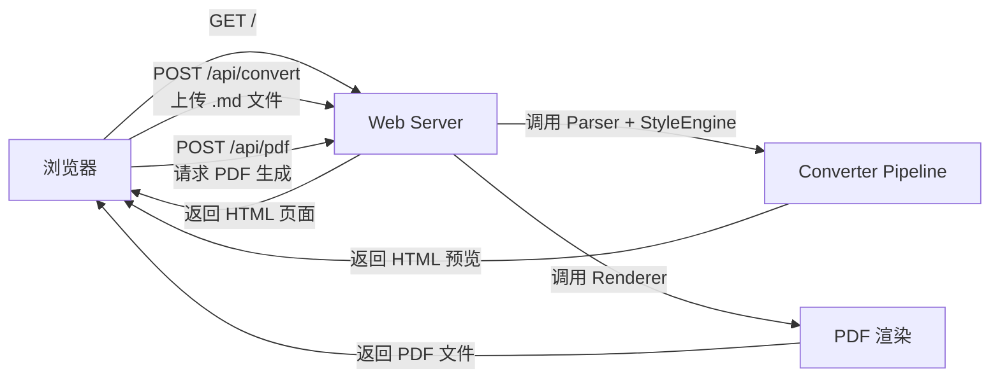
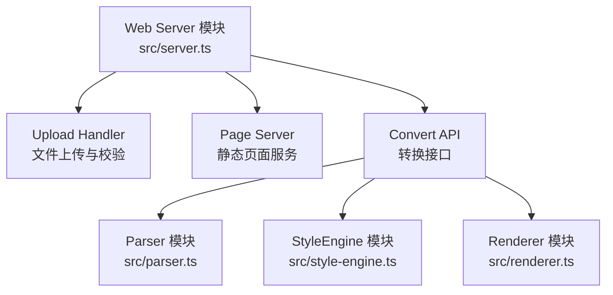
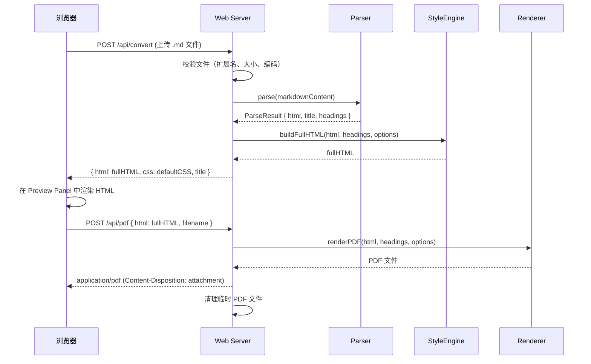

# 设计文档：Web Converter UI

## 概述

在现有 md-to-pdf CLI 工具基础上新增一个 Web 服务层，让用户通过浏览器上传 Markdown 文件、在线预览转换后的 HTML 内容，并下载生成的 PDF 文件。

核心设计思路：

1. **复用现有流水线**：Web 服务直接调用已有的 Parser、StyleEngine、Renderer 模块，不重复实现转换逻辑
2. **轻量级 HTTP 服务**：使用 Node.js 内置 `node:http` 模块构建服务端，不引入 Express 等框架，保持依赖最小化
3. **前后端一体**：前端页面以内嵌 HTML 字符串的方式由服务端直接返回，无需构建工具或前端框架
4. **两阶段转换**：先返回 HTML 预览（快速），用户确认后再触发 PDF 生成（耗时），提升用户体验

### 技术选型理由

| 方案 | 优点 | 缺点 |
|------|------|------|
| node:http（选用） | 零额外依赖、与现有 ESM 项目一致、足够满足简单路由需求 | 路由和中间件需手动实现 |
| Express / Koa | 路由便捷、中间件生态丰富 | 引入额外依赖、对于仅 3-4 个路由的场景过重 |

选择 `node:http` 的原因：本项目仅需处理少量路由（`GET /`、`POST /api/convert`、`POST /api/pdf`），手动路由的复杂度可控，且避免引入新的运行时依赖。

## 架构

### 整体流程



### 模块划分



新增模块：

- **Web Server 模块** (`src/server.ts`)：HTTP 服务核心，负责路由分发、请求处理、响应返回
- **Web Page** (`src/web-page.ts`)：生成前端 HTML 页面字符串，包含上传表单、预览面板和交互逻辑

复用模块（不修改）：

- **Parser 模块** (`src/parser.ts`)：`parse()` 函数直接接收 Markdown 字符串
- **StyleEngine 模块** (`src/style-engine.ts`)：`buildFullHTML()` 和 `getDefaultCSS()` 
- **Renderer 模块** (`src/renderer.ts`)：`renderPDF()` 生成 PDF 文件

### API 路由设计

| 方法 | 路径 | 功能 | 请求体 | 响应 |
|------|------|------|--------|------|
| GET | `/` | 返回 Web 页面 | 无 | `text/html` |
| POST | `/api/convert` | 上传 Markdown 并返回 HTML 预览 | `multipart/form-data`（file 字段） | `application/json`（含 HTML 字符串和 CSS） |
| POST | `/api/pdf` | 根据已转换的 HTML 生成 PDF 并返回 | `application/json`（含 HTML 和原始文件名） | `application/pdf` |

### 请求处理流程



## 组件与接口

### Web Server 模块 (`src/server.ts`)

```typescript
interface ServerOptions {
  port?: number;  // 默认 3000
}

/** 启动 HTTP 服务 */
function startServer(options?: ServerOptions): Promise<http.Server>;

/** 停止 HTTP 服务 */
function stopServer(server: http.Server): Promise<void>;
```

**实现要点**：
- 使用 `node:http.createServer()` 创建服务
- 路由分发：根据 `req.method` + `req.url` 分发到对应处理函数
- 端口冲突检测：监听 `server.on('error')` 事件，检查 `EADDRINUSE` 错误码
- 并发处理：Node.js 事件循环天然支持并发请求，每个请求独立处理
- 超时控制：为转换请求设置 60 秒超时（`setTimeout` + `AbortController`）
- 资源限制：通过活跃请求计数器实现并发限制，超限返回 503

### Upload Handler（server.ts 内部函数）

```typescript
interface UploadResult {
  content: string;   // 文件内容（UTF-8 字符串）
  filename: string;  // 原始文件名
}

/** 解析 multipart/form-data 请求体，提取上传文件 */
function parseUpload(req: http.IncomingMessage): Promise<UploadResult>;

/** 校验上传文件 */
function validateUpload(filename: string, content: Buffer): void;
```

**校验规则**：
- 文件扩展名必须为 `.md` 或 `.markdown`（否则 400）
- 文件大小不超过 10MB（否则 413）
- 文件内容必须为有效 UTF-8 编码（否则 400）
- 请求中必须包含文件（否则 400）

**multipart 解析**：手动解析 `multipart/form-data` boundary，提取文件内容和文件名。这避免引入 `multer` 等依赖，且对于单文件上传场景实现简单。

### Web Page 模块 (`src/web-page.ts`)

```typescript
/** 返回完整的 HTML 页面字符串 */
function getWebPageHTML(): string;
```

**页面结构**：
- 文件上传区域：`<input type="file" accept=".md,.markdown">`
- "转换"按钮：触发文件上传和 HTML 预览
- Preview Panel：`<iframe>` 或 `<div>` 展示转换后的 HTML
- "下载 PDF"按钮：转换成功后显示，触发 PDF 下载
- 错误提示区域：醒目样式展示错误信息
- 响应式布局：使用 CSS media query 适配移动端和桌面端

**前端交互逻辑**（内嵌 `<script>`）：
- 使用 `fetch()` API 发送请求
- 转换流程：选择文件 → 点击转换 → POST /api/convert → 显示预览 + 显示下载按钮
- 下载流程：点击下载 → POST /api/pdf → 触发浏览器下载
- 错误处理：捕获 fetch 错误和非 2xx 响应，展示错误信息

### 新增类型定义 (`src/types.ts`)

```typescript
interface ConvertResponse {
  html: string;      // 完整 HTML（含样式）
  css: string;       // 默认 CSS（供预览使用）
  title: string | null;
}

interface ConvertErrorResponse {
  error: string;     // 错误描述
  code: string;      // 错误码标识
}
```

## 数据模型

### 转换请求数据流

```
浏览器上传 .md 文件
  ↓ multipart/form-data
Web Server 接收并校验
  ↓ Buffer → UTF-8 string
Parser.parse(markdownString)
  ↓ ParseResult { html, title, headings }
StyleEngine.buildFullHTML(html, headings, options)
  ↓ string (完整 HTML)
返回 JSON { html, css, title }
  ↓ 浏览器渲染预览
```

### PDF 生成数据流

```
浏览器发送 { html, filename }
  ↓ POST /api/pdf
Web Server 创建临时文件路径
  ↓ Renderer.renderPDF(html, [], { outputPath: tempPath })
读取临时 PDF 文件
  ↓ fs.readFile(tempPath)
返回 PDF 二进制流
  ↓ Content-Type: application/pdf
清理临时文件
  ↓ fs.unlink(tempPath)
```

### 错误响应格式

所有错误响应统一为 JSON 格式：

```json
{
  "error": "描述性错误信息",
  "code": "ERROR_CODE"
}
```

错误码映射：

| HTTP 状态码 | 错误码 | 场景 |
|-------------|--------|------|
| 400 | `INVALID_EXTENSION` | 文件扩展名不是 .md/.markdown |
| 400 | `INVALID_ENCODING` | 文件不是有效 UTF-8 |
| 400 | `NO_FILE` | 请求中未包含文件 |
| 413 | `FILE_TOO_LARGE` | 文件超过 10MB |
| 422 | `PARSE_ERROR` | Markdown 解析失败 |
| 500 | `RENDER_ERROR` | PDF 渲染失败 |
| 503 | `SERVICE_UNAVAILABLE` | 服务端资源不足 |
| 504 | `TIMEOUT` | 转换超时（60秒） |


## 正确性属性

*属性是一种在系统所有有效执行中都应成立的特征或行为——本质上是对系统应做什么的形式化陈述。属性是人类可读规格说明与机器可验证正确性保证之间的桥梁。*

### 属性 1：无效文件扩展名被拒绝

*对于任意* 文件名，若其扩展名不是 `.md` 或 `.markdown`，则 `validateUpload()` 应抛出错误，且对应的 HTTP 响应状态码为 400。

**验证需求: 3.2**

### 属性 2：超大文件被拒绝

*对于任意* 大于 10MB 的文件内容（Buffer），`validateUpload()` 应抛出错误，且对应的 HTTP 响应状态码为 413。

**验证需求: 3.3**

### 属性 3：无效 UTF-8 编码被拒绝

*对于任意* 包含无效 UTF-8 字节序列的 Buffer，`validateUpload()` 应抛出错误，且对应的 HTTP 响应状态码为 400。

**验证需求: 3.4**

### 属性 4：PDF 文件名推导

*对于任意* 有效的上传文件名（如 `xxx.md` 或 `xxx.markdown`），PDF 响应的 `Content-Disposition` 头中的文件名应为原始文件名的基础名加 `.pdf` 扩展名（即 `xxx.pdf`）。

**验证需求: 4.4, 4.5**

### 属性 5：预览 CSS 与 PDF CSS 一致

*对于任意* 转换请求，`/api/convert` 返回的 CSS 字符串应与 `getDefaultCSS()` 的输出完全一致，确保预览效果与 PDF 输出使用相同的样式。

**验证需求: 5.2**

### 属性 6：临时文件清理

*对于任意* 成功完成的 PDF 生成请求，在响应发送完毕后，服务端生成的临时 PDF 文件应被删除（文件系统中不再存在）。

**验证需求: 4.6**

### 属性 7：端口参数生效

*对于任意* 有效的端口号（1024-65535），当通过参数指定端口时，服务应在该端口上启动并响应请求。

**验证需求: 1.5**

## 错误处理

### 文件上传错误

| 错误场景 | HTTP 状态码 | 错误码 | 处理方式 |
|----------|-------------|--------|----------|
| 文件扩展名不是 .md/.markdown | 400 | `INVALID_EXTENSION` | 返回描述性错误信息，提示支持的文件类型 |
| 文件大小超过 10MB | 413 | `FILE_TOO_LARGE` | 返回错误信息，提示文件大小限制 |
| 文件不是有效 UTF-8 编码 | 400 | `INVALID_ENCODING` | 返回错误信息，提示编码要求 |
| 请求中未包含文件 | 400 | `NO_FILE` | 返回错误信息，提示需要上传文件 |

### 转换错误

| 错误场景 | HTTP 状态码 | 错误码 | 处理方式 |
|----------|-------------|--------|----------|
| Markdown 解析失败 | 422 | `PARSE_ERROR` | 返回解析错误详情 |
| PDF 渲染失败 | 500 | `RENDER_ERROR` | 返回通用渲染错误信息（不暴露内部细节） |
| 转换超时（>60秒） | 504 | `TIMEOUT` | 终止转换进程，返回超时提示 |

### 服务错误

| 错误场景 | HTTP 状态码 | 错误码 | 处理方式 |
|----------|-------------|--------|----------|
| 端口被占用 | - | `EADDRINUSE` | 输出端口冲突错误到 stderr，以非零状态码退出 |
| 并发请求超限 | 503 | `SERVICE_UNAVAILABLE` | 返回服务繁忙提示，建议稍后重试 |

### 错误处理原则

- 所有 API 错误响应统一为 JSON 格式 `{ error: string, code: string }`
- 前端捕获所有非 2xx 响应，在页面上以醒目样式展示错误信息
- 临时文件在任何情况下都应被清理（使用 `try/finally`）
- 超时通过 `AbortController` + `setTimeout` 实现，确保资源释放

## 测试策略

### 双重测试方法

本功能采用单元测试与属性测试相结合的策略：

- **单元测试**：验证具体示例、边界情况和错误条件
- **属性测试**：验证跨所有输入的通用属性

两者互补，缺一不可。

### 属性测试

**库选择**：使用 `fast-check`（项目已安装）作为属性测试库。

**配置要求**：
- 每个属性测试最少运行 100 次迭代
- 每个属性测试必须通过注释引用设计文档中的属性编号
- 标签格式：**Feature: web-converter-ui, Property {number}: {property_text}**
- 每个正确性属性由一个属性测试实现

**属性测试覆盖**：

| 属性 | 测试描述 | 生成器 |
|------|----------|--------|
| 属性 1 | 生成非 .md/.markdown 扩展名的文件名，验证返回 400 | 随机字符串 + 随机非法扩展名生成器 |
| 属性 2 | 生成大于 10MB 的 Buffer，验证返回 413 | 随机大 Buffer 生成器（10MB+1 到 20MB） |
| 属性 3 | 生成包含无效 UTF-8 字节的 Buffer，验证返回 400 | 无效 UTF-8 字节序列生成器 |
| 属性 4 | 生成有效 .md/.markdown 文件名，验证 PDF 文件名推导 | 随机文件名生成器（含路径、中文、特殊字符） |
| 属性 5 | 验证 convert API 返回的 CSS 与 getDefaultCSS() 一致 | 随机 Markdown 内容生成器 |
| 属性 6 | 执行 PDF 生成后验证临时文件已被删除 | 随机 Markdown 内容生成器 |
| 属性 7 | 生成有效端口号，验证服务在该端口启动 | 随机端口号生成器（1024-65535） |

### 单元测试

**库选择**：使用 `vitest` 作为测试框架。

**单元测试覆盖**：

- **具体示例**：
  - GET / 返回 HTML 页面（需求 2.1）
  - 页面包含文件上传区域（需求 2.2）
  - 页面包含转换按钮（需求 2.3）
  - 页面包含预览面板（需求 2.4）
  - 默认端口为 3000（需求 1.4）
  - 启动时控制台输出服务地址（需求 1.2）
  - 并发请求处理（需求 7.1, 7.2）

- **边界情况**：
  - 端口被占用时的错误处理（需求 1.3）
  - 请求中未包含文件（需求 3.5）
  - 转换超时处理（需求 6.4）
  - 并发请求超限返回 503（需求 7.3）

- **错误条件**：
  - 解析阶段错误返回 422（需求 6.1）
  - 渲染阶段错误返回 500（需求 6.2）

### 测试组织

```
tests/
  server.test.ts            # Web Server 单元测试
  server.property.test.ts   # Web Server 属性测试（属性 1-7）
  web-page.test.ts          # Web Page 模块单元测试
```
